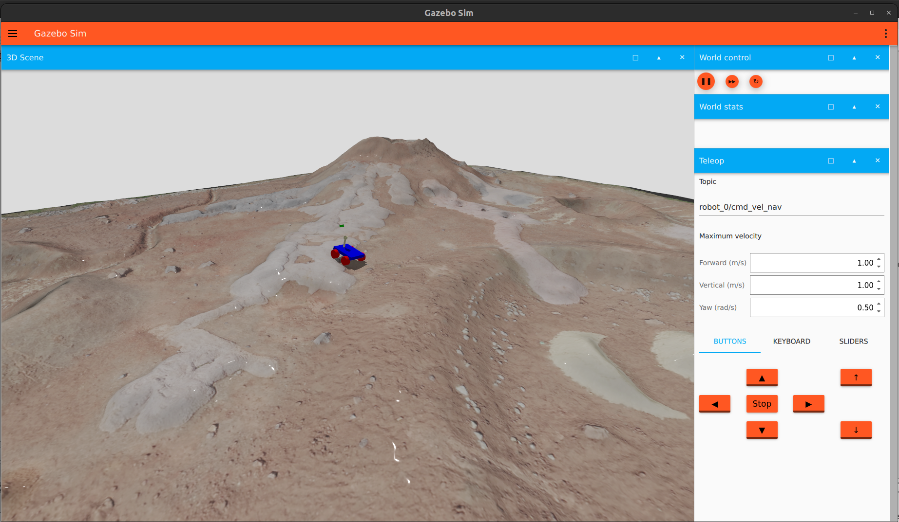
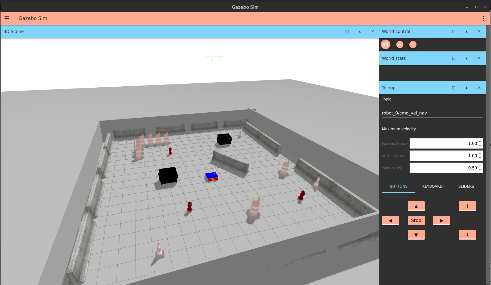
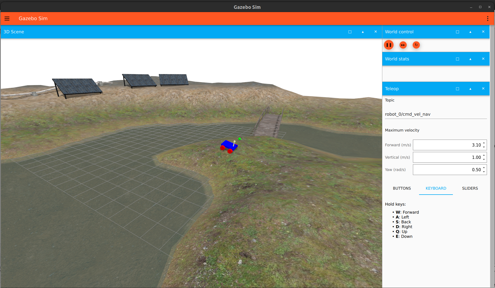

# A dockerised simulation respository for simulating a vehicle on GZ Sim.
Run ```cd <cloned_repo>```

1. ```sudo docker build -t gazebo-vehicle-ros2-gpu-harmonic:humble .```
2. ```sudo docker compose run vehicle_simulator_gz_sim```
3. ```sudo chmod +x launch_simulation.sh```
4. ```./launch_simulation.sh```
5. This will build the packages in the top-right terminal.
6. After the build is complete you can run what was inputted in the top-left terminal. This will launch gazebo and spawn the robot.
7. The GUI is disabled by default.
8. You should be able to teleop the robot through the teleop window.
9. You can run the default simulation RViz from the bottom-right terminal. As long as you are able to see the lidar pointcloud, the rgb and depth images on RViz, you can safely ignore the texture error messages on the simulation terminal window.

# Important information
The namespace of the robot is currently set to ```robot_0```.
The ```ROS_DOMAIN_ID``` is set to 55 in the ```.bashrc```
There are currently two model types. More will be available soon! (Drones, Legged Robots, Multi-Robot Simulations)
You can modify the ```spawn_robot.launch.py``` in the ```vehicle_packages``` to select your desired model.
You can choose from ```model``` and ```model_with_2_lidars```



